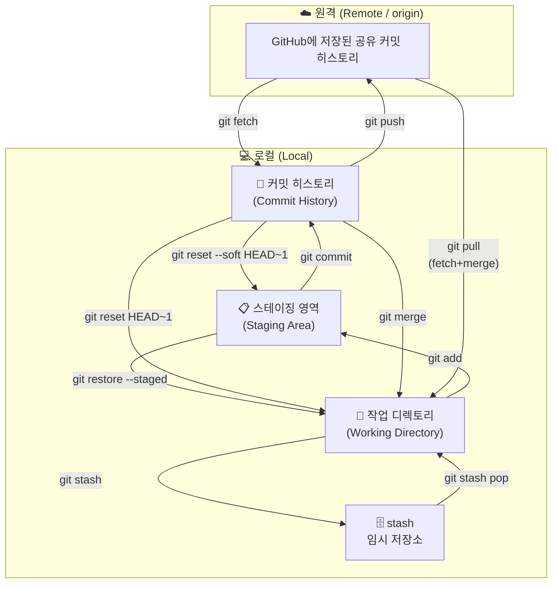

## 전체 구조

- 우리팀 레포 (origin): 일상 작업, feat 브랜치, PR, 리뷰
- 학원 레포 (submit): 최종 제출할 때만 push

---

## Git 핵심 개념

### 세 공간의 흐름

<style>
.mermaid { overflow: auto; }
</style>



> 스테이징 영역은 브랜치가 여럿이어도 레포 전체에서 **하나**입니다.
> 다만 브랜치를 전환할 때 현재 변경사항이 대상 브랜치 파일과 충돌할 수 있으면 `checkout`이 거부될 수 있습니다.

### 브랜치 전환 시 각 공간 상태

| 상황 | 작업 디렉토리 | 스테이징 | 커밋 히스토리 |
| --- | --- | --- | --- |
| 그냥 브랜치 전환 | 따라오거나 전환 거부될 수 있음 ⚠️ | 따라오거나 전환 거부될 수 있음 ⚠️ | 브랜치마다 독립 ✅ |
| `git commit` 후 전환 | 깨끗 ✅ | 깨끗 ✅ | 브랜치마다 독립 ✅ |
| `git stash` 후 전환 | 깨끗 ✅ | 깨끗 ✅ | 변화 없음 |
{: .table .table-sm}

### 동시 작업

**한 사람이 여러 기능을 작업할 때 — git stash**

커밋하기엔 애매한데 브랜치를 바꿔야 할 때, stash로 잠깐 서랍에 넣어두고 돌아왔을 때 꺼내는 방식.

```bash
# A 기능 작업 중 → 잠깐 B 기능으로 전환해야 할 때
git stash                      # 작업 디렉토리 + 스테이징을 임시 저장소에 보관
git checkout feat/B-기능
# B 기능 작업 후 커밋 ...

# 다시 A 기능으로 복귀
git checkout feat/A-기능
git stash pop                  # 임시 저장했던 변경사항 복원

# stash 목록 확인
git stash list
# stash@{0}: On feat/login: 로그인 작업 중
# stash@{1}: On feat/signup: 회원가입 작업 중
```

> `git stash pop`은 stash를 복원하면서 목록에서 제거합니다.
> 충돌이 나면 자동으로 사라지지 않을 수 있으니 `git status`로 확인합니다.

**여러 사람이 동시에 작업할 때**

각자 다른 브랜치에서 작업 → `git merge origin/main`으로 주기적으로 팀원 코드 반영 → PR로 합치기.

---

## PHASE 1 — 프로젝트 시작 (팀장, 1회만)

### Step 1. 두 remote 연결

```bash
git remote add origin [우리팀 레포 URL]   # 우리팀 레포를 origin 이름으로 등록
git remote add submit [학원 레포 URL]     # 학원 제출용 레포를 submit 이름으로 등록
```

### Step 2. Branch Protection 설정

GitHub 레포 → **Settings** → 왼쪽 사이드바 **Rules → Rulesets** → **New branch ruleset**

#### ① Ruleset Name
```
main-protection
```

#### ② Enforcement status
`Active` 유지

#### ③ Bypass list

상황에 따라 두 가지 중 선택:

**admin 권한을 회수하는 경우 (권장)** — 비워두기

> 팀장도 PR을 통해 merge하는 것이 기록 관리 측면에서 더 바람직함.
> admin 권한이 없어지면 "Repository admin" bypass도 무의미해지므로 비워두는 것이 맞음.

**admin 권한을 유지하는 경우** — 본인 계정을 bypass에 추가

```
Add bypass → Role → Repository admin   ← 팀장(admin)은 PR 없이 main에 직접 push 가능
```

또는

```
Add bypass → User → [본인 GitHub 계정명]  ← 특정 계정만 bypass
```

> admin을 유지하면 팀장 본인은 Branch Protection 규칙을 우회할 수 있음.
> 단, 실수로 main에 직접 push할 위험이 있으므로 PR 습관을 유지하는 것이 안전함.

#### ④ Target branches — 어느 브랜치에 규칙을 적용할지
**Add target** 클릭 → **Include by pattern** 선택 → `main` 입력 후 Add

#### ⑤ Branch rules — 체크할 항목

| 항목 | 설정 | 이유 |
|------|------|------|
| Restrict creations | ☐ 체크 안 함 | 브랜치 자유롭게 생성 가능해야 함 |
| Restrict updates | ☐ 체크 안 함 | |
| **Restrict deletions** | ✅ 체크 | main 브랜치 실수로 삭제 방지 |
| Require linear history | ☐ 체크 안 함 | |
| Require merge queue | ☐ 체크 안 함 | |
| Require deployments to succeed | ☐ 체크 안 함 | |
| Require signed commits | ☐ 체크 안 함 | |
| **Require a pull request before merging** | ✅ 체크 | main 직접 push 금지, PR 강제 |
| → Required approvals | **1** 로 설정 | 팀장 1명 승인 필수 |
| → Dismiss stale pull request approvals | ✅ 권장 | 코드 수정 시 재승인 요구 |
| Require status checks to pass | ☐ 체크 안 함 | CI 없으면 생략 |
| **Block force pushes** | ✅ 체크 | `git push --force`로 히스토리 덮어쓰기 방지 |
| Require code scanning results | ☐ 체크 안 함 | |

#### ⑥ 하단 **Create** 클릭

> 설정 완료 후 팀원이 `git push origin main` 시도하면 자동으로 거부됨 — PR만 통과 가능

### Step 3. PR 템플릿 추가

`.github/PULL_REQUEST_TEMPLATE.md` 파일 생성 후 main에 push

---

## PHASE 2 — 매일 반복되는 작업 사이클 (팀원)

### Step 1. 작업 시작 전 — 최신 상태 동기화

```bash
git fetch origin              # GitHub(origin)의 최신 변경사항을 로컬에 다운로드 (브랜치 전환 없음)
git checkout main             # 내 로컬 main 브랜치로 전환
git merge origin/main         # 원격 main의 최신 상태를 내 로컬 main에 반영 (로컬 동기화, 원격 main에 merge하는 것이 아님)
```

> 여기서 `git merge origin/main`은 **내 로컬 `main`을 최신 상태로 맞추는 작업**입니다.
> 팀 규칙에서 금지하는 것은 `main`에 직접 커밋해서 `push`하는 것이며, 위 명령은 그와 다릅니다.
> 작업 중인 파일이 남아 있으면 `checkout main`이 거부될 수 있으므로, 먼저 커밋하거나 `git stash`로 잠시 치워둡니다.

> 왜 먼저 `main`으로 가나요?
> `main`은 팀의 최신 기준점을 로컬에 맞춰두는 브랜치입니다.
> 먼저 로컬 `main`을 최신화해두면 새 브랜치를 정확한 기준점에서 만들 수 있고, 기존 작업 브랜치에도 최신 `main`을 반영하기 쉬워집니다.

**브랜치 확인 명령어**

```bash
git branch -r                              # 원격에 어떤 브랜치들이 있는지 확인
git branch -a                              # 로컬 + 원격 전부 보기
git branch                                 # 내가 지금 어느 브랜치에 있는지
git log main..origin/main --oneline        # fetch 후 origin/main이 몇 커밋 앞서 있는지
```

**브랜치 네이밍 컨벤션**

| prefix | 용도 | 예시 |
| --- | --- | --- |
| `feat/` | 새 기능 개발 | `feat/login-page`, `feat/data-upload` |
| `fix/` | 버그 수정 | `fix/login-null-error`, `fix/map-render` |
| `hotfix/` | 배포 후 긴급 수정 | `hotfix/payment-crash` |
| `chore/` | 설정·문서·패키지 등 기타 | `chore/update-readme`, `chore/env-setup` |
| `refactor/` | 기능 변경 없이 코드 구조 개선 | `refactor/auth-module` |
{: .table .table-sm}

- 소문자 + 하이픈(`-`) 사용, 언더스코어·대문자 금지
- 영어로 작성, 의미를 알 수 있도록 구체적으로
- 너무 길면 안 됨: `feat/user-auth` ✅ / `feat/사용자-로그인-기능-구현` ❌

### Step 2. 이슈 등록 (선택)

이슈(Issue)는 **할 일 목록 / 버그 신고 게시판** 역할을 합니다.
작업 시작 전 이슈를 먼저 등록해두면 팀 전체가 무엇이 진행 중이고 무엇이 남았는지 한눈에 파악할 수 있습니다.

**등록 방법:**
```
레포 → Issues 탭 → New issue → 제목 + 내용 작성 → Submit new issue
```
등록하면 자동으로 `#1`, `#2` 번호가 붙습니다.

**PR과 연결:**

PR 작성 시 `closes #번호` 를 쓰면 해당 PR이 main에 merge될 때 이슈가 자동으로 닫힙니다.

```
closes #3   → merge 시 이슈 #3 자동 close
```

> 이슈를 쓰지 않는 팀이라면 이 단계는 생략해도 됩니다.

---

### Step 3. 작업 브랜치 선택 또는 생성

> Step 1에서 로컬 `main`을 최신화한 뒤, 이제 내가 작업할 브랜치를 고르는 단계입니다.
> **기존 작업 이어서 하기**와 **새 기능 시작하기** 중 하나만 선택하면 됩니다.

#### 기존 브랜치에서 계속 작업할 때

```bash
git checkout {prefix}/{작업명}
git merge origin/main                 # 최신 main을 내 작업 브랜치에 반영하여 팀원 변경사항 동기화
```

> 이 단계는 **원격 main을 내 기능 브랜치로 가져오는 것**입니다.
> 즉, feature branch에서 최신 main을 받아 충돌을 미리 확인하는 과정이며, `main`에 직접 merge하는 것이 아닙니다.

#### 새 기능 시작할 때 브랜치 새로 생성

> 이 단계는 **Step 1을 끝내고 최신 상태의 로컬 `main` 위에서** 실행한다고 가정합니다.
> 즉, 새 브랜치는 최신 `main`에서 갈라져야 합니다.

```bash
# 방법 1 — 한 줄로 (생성 + 전환 동시에, -b = branch)
git checkout -b {prefix}/{작업명}

# 방법 2 — 두 줄로 (생성 후 전환)
git branch {prefix}/{작업명}      # 브랜치만 생성 (전환 안 됨)
git checkout {prefix}/{작업명}    # 생성한 브랜치로 전환
```

> 두 방법은 결과가 동일 — 보통 방법 1을 사용

### Step 4. 작업 확인 & 커밋

```bash
git branch                    # 현재 내가 어느 브랜치에 있는지 확인 (* 표시가 현재 브랜치)

git status                    # 변경된 파일 목록 확인
git diff                      # 파일 내부에서 어떤 줄이 바뀌었는지 확인 (add 전)
git diff --staged             # 스테이징된 변경사항 확인 (add 후)
# 💡 shell보다 편하게 보려면 VSCode 사이드바 Source Control 탭에서 파일 클릭 → 좌우 나란히 비교

git add 파일명                 # 특정 파일만 스테이징
git add .                     # 변경된 모든 파일 스테이징

git commit -m "feat: 설명"    # 커밋
# feat: 설명  — 새 기능
# fix: 설명   — 버그 수정
# chore: 설명 — 기타
```

> 작업 단위를 작게 유지하고 커밋을 자주 남길 것
> `git add .`는 의도하지 않은 파일까지 함께 올라갈 수 있으니 초반에는 `git status`를 본 뒤 파일 단위로 add하는 습관이 더 안전합니다.

**커밋 히스토리 확인**

```bash
git log                     # 전체 커밋 히스토리
git log --oneline           # 한 줄 요약
git log --oneline -5        # 최근 5개만
```

**실수했을 때 되돌리기**

```bash
# git add 취소
git restore --staged 파일명   # 특정 파일만 unstage (파일 내용 유지)
git restore --staged .        # 전체 unstage
```

| 명령어 | 커밋 히스토리 | 스테이징 | 파일 내용 |
| --- | --- | --- | --- |
| `git reset --soft HEAD~1` | 취소 | 유지 | 유지 |
| `git reset HEAD~1` | 취소 | 취소 | 유지 |
| `git reset --hard HEAD~1` | 취소 | 취소 | **삭제** ⚠️ |
{: .table .table-sm}

- `--soft` : 커밋만 취소, 변경사항은 스테이징에 유지 (가장 안전)
- `--mixed` (기본값): 커밋 취소 + unstage, 파일은 유지
- `--hard` : 커밋 + 파일 내용까지 완전 삭제 (복구 불가)

> `HEAD~1` = 바로 직전 커밋 1개, `HEAD~2` = 2개 되돌리기

### Step 5. 브랜치 push

```bash
git push -u origin {prefix}/{기능명}   # 첫 push: 원격 브랜치 생성 + 이후 push/pull 대상 연결
```

> `origin/main`에는 영향 없음 — feat 브랜치만 올라감
> 이미 한 번 `-u`로 연결한 뒤에는 다음부터 `git push`만 써도 됩니다.

### Step 6. GitHub에서 PR 생성

- GitHub → Pull Requests → New Pull Request
- base: `main` ← compare: `feat/기능명`
- 팀장에게 리뷰 요청 (Reviewers 지정)

> `base`는 **변경사항이 들어갈 대상 브랜치**, `compare`는 **내가 작업한 브랜치**입니다.
> 반대로 선택하면 비교 화면이 이상하게 보이므로 항상 `main <- feat/...` 형태인지 확인합니다.

---

## PHASE 3 — 리뷰 & 병합 (팀장)

### Step 1. 코드 리뷰

- PR → Files changed 탭 → 라인별 코멘트
- 수정 요청 시: "Request changes" / 승인 시: "Approve"

#### PR 변경사항이 너무 많을 때 확인 순서

GitHub 화면에서는 PR의 **Files changed** 탭에서 변경 파일을 확인합니다.
파일이 많으면 한 번에 다 보려고 하지 말고, 파일별로 확인한 뒤 본 파일은 **Viewed** 체크를 합니다.

커밋이 잘 나뉘어 있다면 **Commits** 탭에서 커밋 단위로 보는 것이 더 편합니다.

로컬에서 더 자세히 보고 싶으면 먼저 원격 브랜치를 확인합니다.

```bash
git fetch origin
git branch -a
```

예를 들어 아래처럼 보이면:

```bash
* main
  remotes/origin/HEAD -> origin/main
  remotes/origin/import/casting-factory-from-kim
  remotes/origin/main
```

`remotes/origin/import/casting-factory-from-kim`은 다른 사람이 GitHub에 올린 원격 브랜치입니다.
같은 레포에 올라온 브랜치라면 팀장도 로컬로 가져와서 확인할 수 있습니다.

```bash
git checkout -b review/casting-factory-from-kim origin/import/casting-factory-from-kim
```

이제 PR 브랜치의 실제 코드를 로컬에서 열어볼 수 있습니다.
확인이 끝나면 다시 main으로 돌아갑니다.

```bash
git checkout main
```

main 기준으로 어떤 파일이 바뀌었는지만 보려면:

```bash
git diff --name-only main...review/casting-factory-from-kim
```

파일별 변경량을 보고 싶으면:

```bash
git diff --stat main...review/casting-factory-from-kim
```

특정 파일 하나만 자세히 보고 싶으면:

```bash
git diff main...review/casting-factory-from-kim -- path/to/file.py
```

> 다른 사람 계정으로 만든 브랜치라도, PR로 올라왔고 같은 레포의 원격 브랜치에 있으면 checkout해서 볼 수 있습니다.
> fork에서 온 PR이라 원격 브랜치 목록에 보이지 않으면 PR 번호로 가져옵니다.

```bash
git fetch origin pull/PR번호/head:review/pr-PR번호
git checkout review/pr-PR번호
```

### Step 2. Squash merge

feature 브랜치에서 쌓인 여러 커밋을 **하나로 압축**해서 main에 병합하는 방식입니다.

```
feat/login 브랜치 커밋 히스토리 (PR 올리기 전)
  A → B → C → D → E   (5개의 작업 커밋)

Squash merge 후 main
  ... → F              (A~E 내용이 압축된 커밋 1개)
```

**GitHub에서 하는 방법:**

1. PR 페이지 하단으로 스크롤
2. **"Merge pull request"** 버튼 옆 드롭다운(▼) 클릭
3. **"Squash and merge"** 선택
4. 커밋 메시지 확인/수정 후 **"Confirm squash and merge"** 클릭

```
[ Merge pull request ▼ ]
  ├ Create a merge commit      ← 기본값 (사용 안 함)
  ├ Squash and merge           ← 이걸 선택
  └ Rebase and merge
```

| 방식 | main 히스토리 | 언제 쓰나 |
| --- | --- | --- |
| **Create a merge commit** | 브랜치 커밋 전부 + merge 커밋 추가 | 히스토리 전부 보존할 때 |
| **Squash and merge** | 커밋 1개로 압축 | 팀 작업, main 히스토리 깔끔하게 |
| **Rebase and merge** | 브랜치 커밋 전부 (merge 커밋 없음) | 선형 히스토리 유지할 때 |
{: .table .table-sm}

### Step 3. 브랜치 삭제

**방법 1 — GitHub 웹 (권장):** merge 직후 PR 페이지에 "Delete branch" 버튼이 뜸 → 클릭

**방법 2 — 명령어:**

```bash
# 원격 브랜치 삭제
git push origin --delete feat/기능명

# 로컬 브랜치 삭제 (merge 완료된 경우)
git branch -d feat/기능명

# 로컬 브랜치 강제 삭제 (merge 여부 무관)
git branch -D feat/기능명
```

> Squash merge를 하면 feat 브랜치 커밋들이 main에 흡수되므로, 원래 feat 브랜치는 역할이 끝난 것입니다. 바로 삭제하는 것이 원칙입니다.
> feat 브랜치를 삭제하지 않고 계속 작업하면, 다음 PR에서 이미 병합된 커밋이 다시 diff로 잡힐 수 있습니다.

---

## PHASE 4 — 버전 태깅 (팀장, 마일스톤마다)

```bash
git checkout main
git pull origin main
git tag -a v0.1 -m "v0.1" # 현재 커밋에 주석(annotated) 태그 생성
git push origin v0.1       # 태그를 origin에 업로드
```

| 태그 | 기준 |
| --- | --- |
| v0.1 | 핵심 기능 첫 동작 |
| v0.2 | 기능 추가 완료 |
| v1.0 | 최종 제출 |
{: .table .table-sm}

---

## PHASE 5 — 학원 레포 최종 제출 (팀장만, 제출 시 1회)

```bash
git checkout main
git pull origin main
git push submit main        # 로컬 main을 학원 레포(submit)에 업로드
```

> ⚠️ submit remote는 제출 목적 전용 — 일상 작업에 사용 금지
> 제출 전에 `git remote -v`로 `origin`과 `submit` URL이 맞는지 한 번 확인하면 실수를 줄일 수 있습니다.

---

## 핵심 원칙 요약

| 원칙 | 이유 |
| --- | --- |
| main 직접 push 금지 | branch protection으로 강제됨 |
| 작업 시작 전 항상 git fetch | 충돌 방지 |
| PR 단위를 작게 유지 | 리뷰 부담 감소 |
| Squash merge 사용 | main 히스토리 가독성 유지 |
| submit은 제출용만 | origin과 용도 분리 |
{: .table .table-sm}

---

## GitHub Actions 탭 용어

Actions 탭은 자동화 파이프라인 실행 내역을 보는 곳.

**Workflow** — 자동화 작업 정의 파일 (`.github/workflows/publish.yml`)

**Event** — workflow를 트리거한 원인

```yaml
on:
  push:              # push 이벤트
    branches: [main]
  pull_request:      # PR 이벤트
  workflow_dispatch: # 수동 실행 이벤트
```

**Status** — 실행 결과: `success` / `failure` / `pending` / `running` / `cancelled`

**Branch** — 어느 브랜치에서 트리거됐는지 (예: `feat/login`)

**Actor** — 누가 트리거했는지 (예: `Daye-Lee18`, `github-actions[bot]`)
