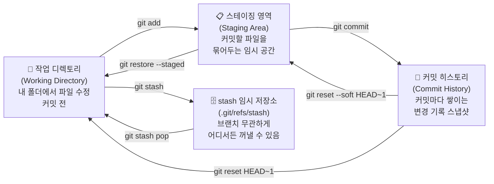

## 전체 구조

- 우리팀 레포 (origin): 일상 작업, feat 브랜치, PR, 리뷰
- 학원 레포 (submit): 최종 제출할 때만 push

---

## Git 핵심 개념

### 세 공간의 흐름



> 스테이징 영역은 브랜치가 여럿이어도 레포 전체에서 **하나** — 브랜치를 전환해도 add한 내용이 그대로 따라옴

### 브랜치 전환 시 각 공간 상태

| 상황 | 작업 디렉토리 | 스테이징 | 커밋 히스토리 |
|------|-------------|---------|------------|
| 그냥 브랜치 전환 | 따라옴 ⚠️ | 따라옴 ⚠️ | 브랜치마다 독립 ✅ |
| `git commit` 후 전환 | 깨끗 ✅ | 깨끗 ✅ | 브랜치마다 독립 ✅ |
| `git stash` 후 전환 | 깨끗 ✅ | 깨끗 ✅ | 변화 없음 |

### 동시 작업

**한 사람이 여러 기능을 작업할 때 — git stash**

커밋하기엔 애매한데 브랜치를 바꿔야 할 때, stash로 잠깐 서랍에 넣어두고 돌아왔을 때 꺼내는 방식.

```bash
# A 기능 작업 중 → 잠깐 B 기능으로 전환해야 할 때
git stash                      # 작업 디렉토리 + 스테이징을 임시 저장소에 보관
git checkout feat/B-기능
# B 기능 작업 후 커밋 ...

# 다시 A 기능으로 복귀
git checkout feat/A-기능
git stash pop                  # 임시 저장했던 변경사항 복원

# stash 목록 확인
git stash list
# stash@{0}: On feat/login: 로그인 작업 중
# stash@{1}: On feat/signup: 회원가입 작업 중
```

**여러 사람이 동시에 작업할 때**

각자 다른 브랜치에서 작업 → `git merge origin/main`으로 주기적으로 팀원 코드 반영 → PR로 합치기.

---

## PHASE 1 — 프로젝트 시작 (팀장, 1회만)

### Step 1. 두 remote 연결

```bash
git remote add origin [우리팀 레포 URL]   # 우리팀 레포를 origin 이름으로 등록
git remote add submit [학원 레포 URL]     # 학원 제출용 레포를 submit 이름으로 등록
```

### Step 2. Branch Protection 설정

GitHub → Settings → Branches → Add ruleset
- 대상: `main`
- Require pull request before merging (Required approvals: 1)
- Block force pushes

### Step 3. PR 템플릿 추가

`.github/PULL_REQUEST_TEMPLATE.md` 파일 생성 후 main에 push

---

## PHASE 2 — 매일 반복되는 작업 사이클 (팀원)

### Step 1. 작업 시작 전 — 최신 상태 동기화

```bash
git fetch origin              # Github(origin)에 있는 모든 브랜치 최신 변경사항을 로컬에 다운로드 (브랜치 전환 없음)
git checkout main             # 내 로컬 main 브랜치로 전환
git merge origin/main         # 다운로드한 origin/main을 현재 브랜치에 병합 (= git pull origin main)
```

**브랜치 확인 명령어**

```bash
git branch -r                              # 원격에 어떤 브랜치들이 있는지 확인
git branch -a                              # 로컬 + 원격 전부 보기
git branch                                 # 내가 지금 어느 브랜치에 있는지
git log main..origin/main --oneline        # fetch 후 origin/main이 몇 커밋 앞서 있는지
```

### Step 2. 기능 브랜치 생성

> **새 기능 시작할 때** → 새 브랜치 생성 / **기존 브랜치에서 계속 작업할 때** → 브랜치 새로 만들지 말고 작업

#### 기존 브랜치에서 계속 작업할 때

```bash
git fetch origin
git checkout {prefix}/{내가작업하던브랜치}
git merge origin/main                 # 그 사이 main에 들어온 팀원 코드 반영
```

#### 새 기능 시작할 때 브랜치 새로 생성

```bash
# 방법 1 — 한 줄로 (생성 + 전환 동시에, -b = branch)
git checkout -b {prefix}/{기능명}

# 방법 2 — 두 줄로 (생성 후 전환)
git branch {prefix}/{기능명}      # 브랜치만 생성 (전환 안 됨)
git checkout {prefix}/{기능명}    # 생성한 브랜치로 전환
```

> 두 방법은 결과가 동일 — 보통 방법 1을 사용

**브랜치 네이밍 컨벤션**

| prefix | 용도 | 예시 |
|--------|------|------|
| `feat/` | 새 기능 개발 | `feat/login-page`, `feat/data-upload` |
| `fix/` | 버그 수정 | `fix/login-null-error`, `fix/map-render` |
| `hotfix/` | 배포 후 긴급 수정 | `hotfix/payment-crash` |
| `chore/` | 설정·문서·패키지 등 기타 | `chore/update-readme`, `chore/env-setup` |
| `refactor/` | 기능 변경 없이 코드 구조 개선 | `refactor/auth-module` |

- 소문자 + 하이픈(`-`) 사용, 언더스코어·대문자 금지
- 영어로 작성, 의미를 알 수 있도록 구체적으로
- 너무 길면 안 됨: `feat/user-auth` ✅ / `feat/사용자-로그인-기능-구현` ❌

### Step 3. 작업 확인 & 커밋

```bash
git branch                    # 현재 내가 어느 브랜치에 있는지 확인 (* 표시가 현재 브랜치)

git status                    # 변경된 파일 목록 확인
git diff                      # 파일 내부에서 어떤 줄이 바뀌었는지 확인 (add 전)
git diff --staged             # 스테이징된 변경사항 확인 (add 후)
# 💡 shell보다 편하게 보려면 VSCode 사이드바 Source Control 탭에서 파일 클릭 → 좌우 나란히 비교

git add 파일명                 # 특정 파일만 스테이징
git add .                     # 변경된 모든 파일 스테이징

git commit -m "feat: 설명"    # 커밋
# feat: 설명  — 새 기능
# fix: 설명   — 버그 수정
# chore: 설명 — 기타
```

> 작업 단위를 작게 유지하고 커밋을 자주 남길 것

**커밋 히스토리 확인**

```bash
git log                     # 전체 커밋 히스토리
git log --oneline           # 한 줄 요약
git log --oneline -5        # 최근 5개만
```

**실수했을 때 되돌리기**

```bash
# git add 취소
git restore --staged 파일명   # 특정 파일만 unstage (파일 내용 유지)
git restore --staged .        # 전체 unstage
```

| 명령어 | 커밋 히스토리 | 스테이징 | 파일 내용 |
|--------|-------------|---------|---------|
| `git reset --soft HEAD~1` | 취소 | 유지 | 유지 |
| `git reset HEAD~1` | 취소 | 취소 | 유지 |
| `git reset --hard HEAD~1` | 취소 | 취소 | **삭제** ⚠️ |

- `--soft` : 커밋만 취소, 변경사항은 스테이징에 유지 (가장 안전)
- `--mixed` (기본값): 커밋 취소 + unstage, 파일은 유지
- `--hard` : 커밋 + 파일 내용까지 완전 삭제 (복구 불가)

> `HEAD~1` = 바로 직전 커밋 1개, `HEAD~2` = 2개 되돌리기

### Step 4. 브랜치 push

```bash
git push origin {prefix}/{기능명}   # 로컬 브랜치를 origin 원격 레포에 업로드
```

> `origin/main`에는 영향 없음 — feat 브랜치만 올라감

### Step 5. GitHub에서 PR 생성

- GitHub → Pull Requests → New Pull Request
- base: `main` ← compare: `feat/기능명`
- 팀장에게 리뷰 요청 (Reviewers 지정)

---

## PHASE 3 — 리뷰 & 병합 (팀장)

### Step 1. 코드 리뷰

- PR → Files changed 탭 → 라인별 코멘트
- 수정 요청 시: "Request changes" / 승인 시: "Approve"

### Step 2. Squash merge

```
GitHub → PR → Merge pull request → Squash and merge
```

> Squash merge 권장: main 히스토리를 커밋 1개로 깔끔하게 유지

### Step 3. 브랜치 삭제

- merge 후 GitHub에서 "Delete branch" 클릭

---

## PHASE 4 — 버전 태깅 (팀장, 마일스톤마다)

```bash
git checkout main
git pull origin main
git tag v0.1               # 현재 커밋에 태그 생성
git push origin v0.1       # 태그를 origin에 업로드
```

| 태그  | 기준 |
|-------|------|
| v0.1  | 핵심 기능 첫 동작 |
| v0.2  | 기능 추가 완료 |
| v1.0  | 최종 제출 |

---

## PHASE 5 — 학원 레포 최종 제출 (팀장만, 제출 시 1회)

```bash
git checkout main
git pull origin main
git push submit main        # 로컬 main을 학원 레포(submit)에 업로드
```

> ⚠️ submit remote는 제출 목적 전용 — 일상 작업에 사용 금지

---

## 핵심 원칙 요약

| 원칙 | 이유 |
|------|------|
| main 직접 push 금지 | branch protection으로 강제됨 |
| 작업 시작 전 항상 git fetch | 충돌 방지 |
| PR 단위를 작게 유지 | 리뷰 부담 감소 |
| Squash merge 사용 | main 히스토리 가독성 유지 |
| submit은 제출용만 | origin과 용도 분리 |

---

## GitHub Actions 탭 용어

Actions 탭은 자동화 파이프라인 실행 내역을 보는 곳.

**Workflow** — 자동화 작업 정의 파일 (`.github/workflows/publish.yml`)

**Event** — workflow를 트리거한 원인

```yaml
on:
  push:              # push 이벤트
    branches: [main]
  pull_request:      # PR 이벤트
  workflow_dispatch: # 수동 실행 이벤트
```

**Status** — 실행 결과: `success` / `failure` / `pending` / `running` / `cancelled`

**Branch** — 어느 브랜치에서 트리거됐는지 (예: `feat/login`)

**Actor** — 누가 트리거했는지 (예: `Daye-Lee18`, `github-actions[bot]`)
