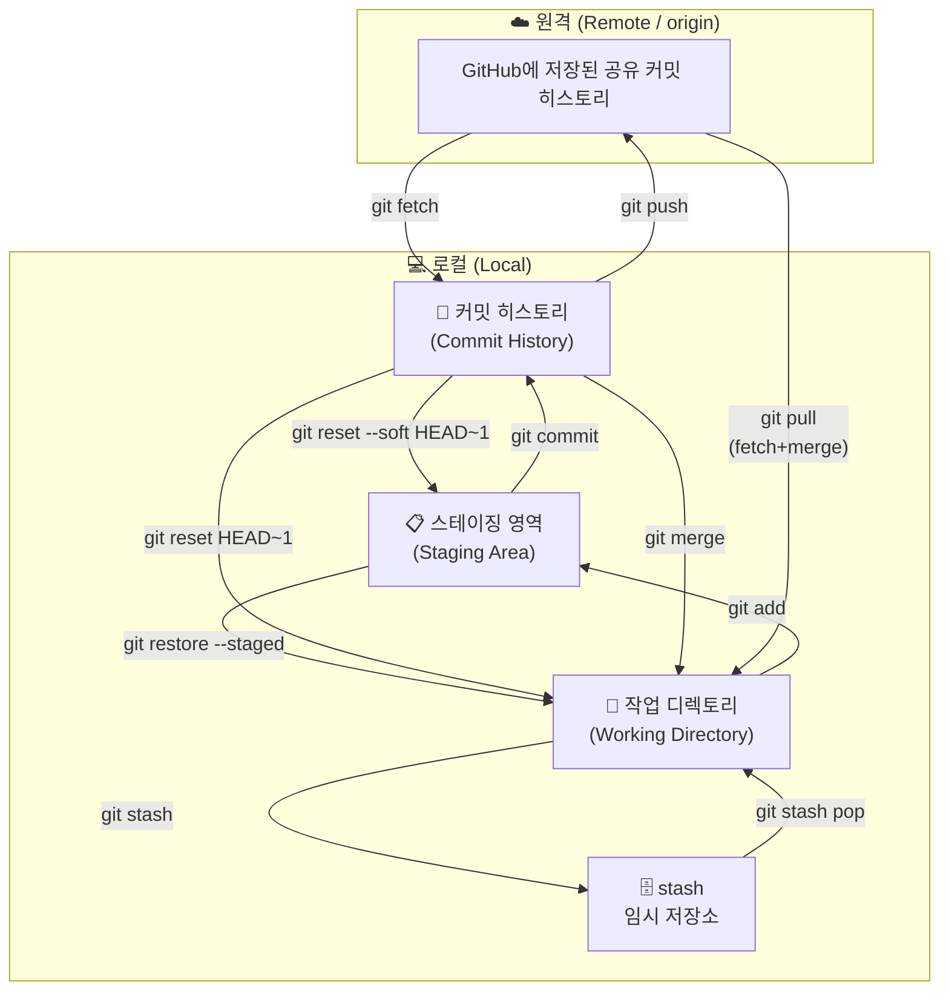

## 이 문서에서 보는 것

- 작업 시작 전 최신화
- 브랜치 생성 또는 이어 작업
- 커밋, push, PR

## 전체 구조

- 우리팀 레포 (`origin`): 일상 작업, feat 브랜치, PR, 리뷰
- 학원 레포 (`submit`): 최종 제출할 때만 push

---

## Git 핵심 개념

### 세 공간의 흐름

<style>
.mermaid { overflow: auto; }
</style>



> 스테이징 영역은 브랜치가 여럿이어도 레포 전체에서 **하나**입니다.
> 브랜치를 전환할 때 현재 변경사항이 대상 브랜치 파일과 충돌하면 `checkout`이 거부될 수 있습니다.
{: .block-tip }

### `git checkout`의 두 가지 역할

`git checkout`은 크게 두 가지 용도로 쓰입니다.

| 용도 | 명령어 예시 | 의미 |
| --- | --- | --- |
| 브랜치/커밋 전환 | `git checkout feat/login` | 다른 브랜치나 특정 커밋으로 이동 |
| 작업 내용 되돌리기 | `git checkout -- app.py` 또는 `git checkout .` | Working Directory의 수정 내용을 마지막 커밋 상태로 복원 |
{: .table .table-sm .table-striped}

```bash
# 브랜치 전환
git checkout feat/login

# 새 브랜치 생성 + 전환
git checkout -b feat/login

# 특정 파일의 수정 내용 삭제
git checkout -- app.py

# 현재 폴더 아래의 tracked file 수정 내용 전체 삭제
git checkout .
```

> `git checkout -- 파일명` 또는 `git checkout .`은 commit하지 않은 수정 내용을 되돌립니다.
> 실행 전에는 반드시 `git status`와 `git diff`로 없어져도 되는 변경인지 확인합니다.
{: .block-warning }

### 동시 작업

**한 사람이 여러 기능을 작업할 때**

커밋하기엔 애매한데 브랜치를 바꿔야 할 때 `git stash`를 사용합니다.

```bash
git stash
git checkout feat/B-기능
# B 기능 작업 후 커밋 ...
git checkout feat/A-기능
git stash pop
```

> `git stash pop`은 stash를 복원하면서 목록에서 제거합니다.
> 충돌이 나면 자동으로 사라지지 않을 수 있으니 `git status`로 확인합니다.
{: .block-tip }

**여러 사람이 동시에 작업할 때**

각자 다른 브랜치에서 작업하고, 주기적으로 `git merge origin/main`으로 최신 main을 받아옵니다.

---

## PHASE 2 — 매일 반복되는 작업 사이클 (팀원)

### Step 1. 작업 시작 전 - 최신 상태 동기화

```bash
git fetch origin
git checkout main
git merge origin/main
```

> 여기서 `git merge origin/main`은 **내 로컬 `main`을 최신 상태로 맞추는 작업**입니다.
> `main`에 직접 commit해서 push하는 것과는 다릅니다.
{: .block-tip }

**브랜치 확인 명령어**

```bash
git branch -r
git branch -a
git branch
git log main..origin/main --oneline
```

**브랜치 네이밍 컨벤션**

| prefix | 용도 | 예시 |
| --- | --- | --- |
| `feat/` | 새 기능 개발 | `feat/login-page`, `feat/data-upload` |
| `fix/` | 버그 수정 | `fix/login-null-error`, `fix/map-render` |
| `hotfix/` | 배포 후 긴급 수정 | `hotfix/payment-crash` |
| `chore/` | 설정·문서·패키지 등 기타 | `chore/update-readme`, `chore/env-setup` |
| `refactor/` | 기능 변경 없이 코드 구조 개선 | `refactor/auth-module` |
{: .table .table-sm .table-striped}

- 소문자 + 하이픈(`-`) 사용, 언더스코어·대문자 금지
- 영어로 작성, 의미를 알 수 있도록 구체적으로
- 너무 길면 안 됨: `feat/user-auth` ✅ / `feat/사용자-로그인-기능-구현` ❌

### Step 2. 이슈 등록 (선택)

이슈는 할 일 목록 / 버그 신고 게시판 역할입니다.

```bash
레포 → Issues 탭 → New issue → 제목 + 내용 작성 → Submit new issue
```

PR 작성 시 `closes #번호`를 쓰면 merge될 때 이슈가 자동으로 닫힙니다.

> 이슈를 쓰지 않는 팀이라면 이 단계는 생략해도 됩니다.
{: .block-tip }

### Step 3. 작업 브랜치 선택 또는 생성

#### 기존 브랜치에서 계속 작업할 때

```bash
git checkout {prefix}/{작업명}
git merge origin/main
```

> feature branch에서 최신 main을 받아 충돌을 미리 확인하는 과정입니다.
{: .block-tip }

#### 새 기능 시작할 때 브랜치 새로 생성

```bash
git checkout -b {prefix}/{작업명}
```

#### 다른 사람이 push만 해둔 브랜치를 받아서 새 브랜치로 이어 작업할 때

```bash
git fetch origin
git branch -r
git checkout -b {내새브랜치명} origin/{다른사람브랜치명}
```

예시:

```bash
git checkout -b feat/my-fix origin/feat/casting-factory-from-kim
```

> `origin/{다른사람브랜치명}`을 시작점으로 삼고, 내 브랜치를 따로 만듭니다.
> 그 다음부터는 내 브랜치에서 커밋을 쌓고 `git push -u origin {내새브랜치명}`으로 올리면 됩니다.
{: .block-tip }

### Step 4. 작업 확인 & 커밋

```bash
git branch
git status
git diff
git diff --staged

git add 파일명
git add .

git commit -m "feat: 설명"
```

> 작업 단위를 작게 유지하고 커밋을 자주 남길 것
{: .block-warning }

**실수했을 때 되돌리기**

```bash
git restore --staged 파일명
git restore --staged .
```

| 명령어 | 커밋 히스토리 | 스테이징 | 파일 내용 |
| --- | --- | --- | --- |
| `git reset --soft HEAD~1` | 취소 | 유지 | 유지 |
| `git reset HEAD~1` | 취소 | 취소 | 유지 |
| `git reset --hard HEAD~1` | 취소 | 취소 | **삭제** ⚠️ |
{: .table .table-sm .table-striped}

### Step 5. 내 로컬 브랜치 원격에 올리기

```bash
git push -u origin {prefix}/{기능명}
```

> `origin/main`에는 영향 없음. feat 브랜치만 올라갑니다.
{: .block-tip }

### Step 6. GitHub에서 PR 생성

- GitHub → Pull Requests → New Pull Request
- base: `main` ← compare: `feat/기능명`
- 팀장에게 리뷰 요청

> `base`는 변경사항이 들어갈 대상 브랜치, `compare`는 내가 작업한 브랜치입니다.
{: .block-tip }
