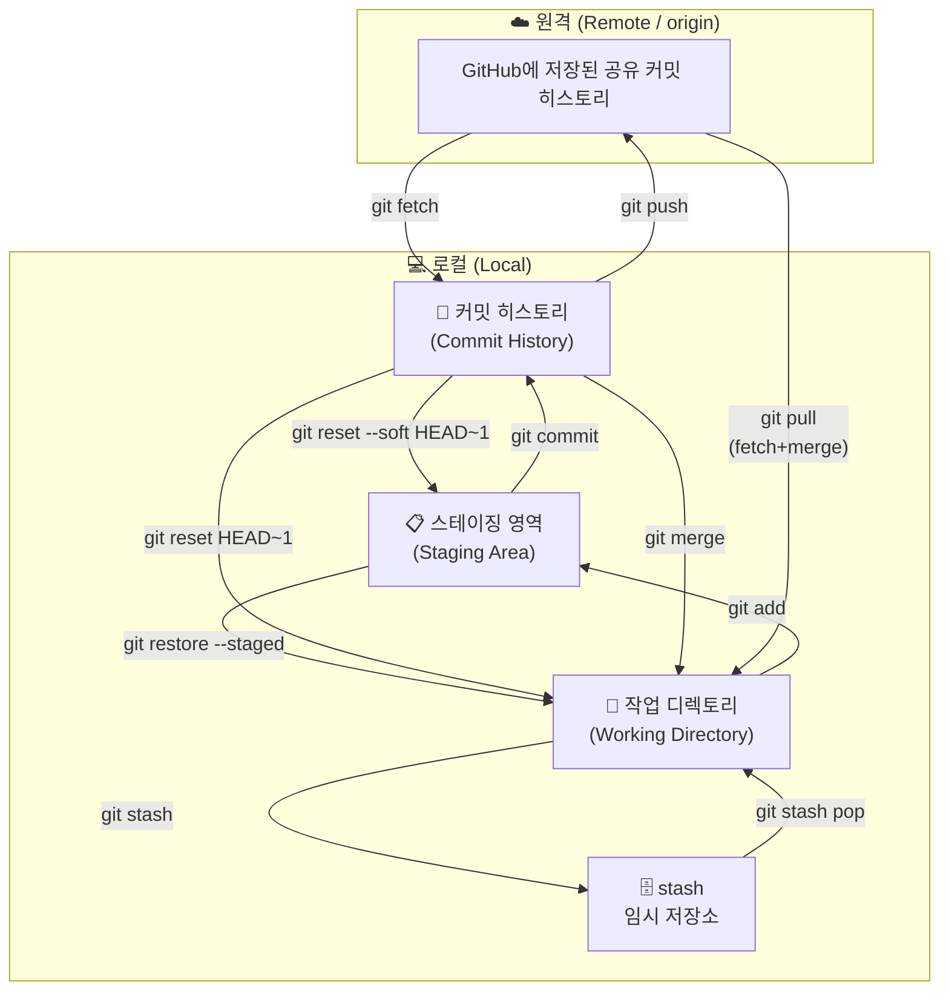
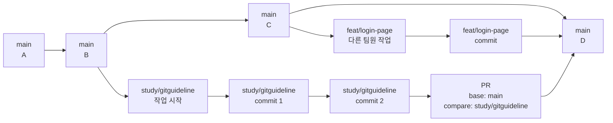

## 이 문서에서 보는 것

- 작업 시작 전 최신화
- 브랜치 생성 또는 이어 작업
- 커밋, push, PR

## 전체 구조

- 우리팀 레포 (`origin`): 일상 작업, feat 브랜치, PR, 리뷰
- 학원 레포 (`submit`): 최종 제출할 때만 push

---

## 매일 반복 작업 사이클

### Step 1. 작업 시작 전 최신화

작업을 시작하기 전에는 항상 원격의 최신 상태를 받아옵니다.
`main`을 최신으로 맞춘 뒤 새 브랜치를 만들거나 기존 브랜치로 이동합니다.

```bash
git fetch origin
git checkout main
git merge origin/main
```

> 여기서 `git merge origin/main`은 내 로컬 `main`을 최신 상태로 맞추는 작업입니다.
> `main`에 직접 commit해서 push하는 것과는 다릅니다.
{: .block-tip }

브랜치 상태를 확인할 때 자주 쓰는 명령어입니다.

```bash
git branch
git branch -r
git branch -a
git log main..origin/main --oneline
```

### Step 2. 이슈 등록 (선택)

이슈는 할 일 목록 / 버그 신고 게시판 역할입니다.

```text
레포 → Issues 탭 → New issue → 제목 + 내용 작성 → Submit new issue
```

PR 작성 시 `closes #번호`를 쓰면 merge될 때 이슈가 자동으로 닫힙니다.

> 이슈를 쓰지 않는 팀이라면 이 단계는 생략해도 됩니다.
{: .block-tip }

### Step 3. 작업 브랜치 선택 또는 생성

#### 새 기능 시작할 때 브랜치 새로 생성

```bash
git checkout -b {prefix}/{작업명}
# 예: git checkout -b feat/login-page
```

#### 기존 브랜치에서 계속 작업할 때

```bash
git fetch origin
git checkout {prefix}/{작업명}
git merge origin/main
```

> feature branch에서 최신 main을 받아 충돌을 미리 확인하는 과정입니다.
{: .block-tip }

#### 다른 사람이 push만 해둔 브랜치를 받아서 새 브랜치로 이어 작업할 때

```bash
git fetch origin
git branch -r
git checkout -b {내새브랜치명} origin/{다른사람브랜치명}
```

예시:

```bash
git checkout -b feat/my-fix origin/feat/casting-factory-from-kim
```

> `origin/{다른사람브랜치명}`을 시작점으로 삼고, 내 브랜치를 따로 만듭니다.
> 그 다음부터는 내 브랜치에서 커밋을 쌓고 `git push -u origin {내새브랜치명}`으로 올리면 됩니다.
{: .block-tip }

브랜치 이름만 봐도 무슨 작업인지 알 수 있게 적습니다.

| prefix | 용도 | 예시 |
| --- | --- | --- |
| `feat/` | 새 기능 개발 | `feat/login-page`, `feat/data-upload` |
| `fix/` | 버그 수정 | `fix/login-null-error`, `fix/map-render` |
| `hotfix/` | 배포 후 긴급 수정 | `hotfix/payment-crash` |
| `chore/` | 설정·문서·패키지 등 기타 | `chore/update-readme`, `chore/env-setup` |
| `refactor/` | 기능 변경 없이 코드 구조 개선 | `refactor/auth-module` |
{: .table .table-sm .table-striped}

- 소문자 + 하이픈(`-`) 사용, 언더스코어·대문자 금지
- 영어로 작성, 의미를 알 수 있도록 구체적으로
- 너무 길면 안 됨: `feat/user-auth` ✅ / `feat/사용자-로그인-기능-구현` ❌

### Step 4. 작업 확인 & 커밋

```bash
git branch
git status
git diff
git diff --staged
git diff --name-only --diff-filter=U

git add {파일명}
git add .

git commit -m "feat: 설명"
```

> 작업 단위를 작게 유지하고 commit을 자주 남길 것
> `git add .`를 쓰기 전에는 의도하지 않은 파일이 같이 들어가지 않았는지 `git status`로 확인할 것
{: .block-warning }

실수로 staging에 올린 파일을 내릴 때:

```bash
git restore --staged 파일명
git restore --staged .
```

커밋을 되돌릴 때 자주 보는 명령어입니다.

| 명령어 | 커밋 히스토리 | 스테이징 | 파일 내용 |
| --- | --- | --- | --- |
| `git reset --soft HEAD~1` | 취소 | 유지 | 유지 |
| `git reset HEAD~1` | 취소 | 취소 | 유지 |
| `git reset --hard HEAD~1` | 취소 | 취소 | **삭제** ⚠️ |
{: .table .table-sm .table-striped}

### Step 5. 내 로컬 브랜치 원격에 올리기

```bash
# 처음 push할 때
git push -u origin {prefix}/{작업명}

# 그 다음부터 같은 브랜치에 추가 push할 때
git push
```

> `origin/main`에는 영향 없음. 내 작업 브랜치만 올라갑니다.
{: .block-tip }

### Step 6. GitHub에서 PR 생성

해당 기능에 대한 모든 작업이 끝난 후 PR을 보냅니다.

```text
GitHub → Pull requests → New pull request
base: main
compare: 내가 작업한 브랜치
Create pull request
```

> PR 제목과 설명에는 "무엇을 왜 바꿨는지"를 적습니다.
> 리뷰어가 코드를 보기 전에 의도를 이해할 수 있어야 합니다.
{: .block-tip }

### Step 7. 리뷰 수정사항 반영

PR에서 수정 요청을 받으면 같은 브랜치에서 고친 뒤 다시 commit/push합니다.
새 PR을 만들 필요는 없습니다.

```bash
git checkout {prefix}/{기능명}

# 수정 작업 후
git status
git add {수정한파일}
git commit -m "fix: 리뷰 반영"
git push
```

> 이미 PR이 열려 있는 브랜치에 push하면 GitHub PR 내용이 자동으로 업데이트됩니다.
{: .block-tip }

### Step 8. main 변경사항을 내 브랜치에 반영

작업 중에 다른 PR이 먼저 merge되면 내 브랜치가 예전 main을 기준으로 남아 있을 수 있습니다.
그럴 때는 최신 main을 받아와서 내 브랜치에 합칩니다.

```bash
git fetch origin
git checkout {prefix}/{기능명}
git merge origin/main
```

충돌이 없으면 그대로 작업을 계속하면 됩니다.
충돌이 나면 충돌 파일을 직접 고친 뒤 merge commit을 마무리합니다.

```bash
git status
git diff --name-only --diff-filter=U

# 충돌 파일 수정 후
git add {충돌해결한파일}
git commit
git push
```

> `git commit`을 실행하면 Git이 merge commit 메시지를 자동으로 준비해 줍니다.
> 특별히 바꿀 내용이 없으면 저장하고 종료하면 됩니다.
{: .block-tip }

### Step 9. PR merge 후 내 브랜치 정리

PR이 merge되면 작업 브랜치의 역할은 끝납니다.
GitHub에서 `Delete branch` 버튼이 보이면 원격 브랜치를 먼저 삭제할 수 있습니다.

로컬에서는 최신 main으로 이동한 뒤 작업 브랜치를 삭제합니다.

```bash
git checkout main
git fetch origin
git merge origin/main

git branch -d {prefix}/{기능명}
```

원격 브랜치까지 터미널에서 삭제하고 싶으면 아래처럼 합니다.

```bash
git push origin --delete {prefix}/{기능명}
```

로컬에 남아 있는 원격 브랜치 목록을 정리하려면:

```bash
git fetch --prune origin
git branch -a
```

> `git branch -d`는 merge된 브랜치만 안전하게 삭제합니다.
> 아직 merge되지 않은 브랜치를 강제로 지우려면 `git branch -D {브랜치명}`을 쓰지만, 커밋을 잃을 수 있으니 PR merge 여부를 먼저 확인합니다.
{: .block-warning }

## Conflict가 난 경우 대처법

충돌은 Git이 "두 사람이 같은 부분을 바꿔서 자동으로 합칠 수 없다"고 알려주는 상태입니다.
먼저 어떤 파일에서 충돌이 났는지 확인합니다.

```bash
git status
git diff --name-only --diff-filter=U
```

충돌 파일에는 보통 아래 표시가 생깁니다.

```text
<<<<<<< HEAD
내 현재 브랜치의 내용
=======
합치려는 브랜치의 내용
>>>>>>> origin/main
```

해결 순서:

1. 충돌난 파일을 열어서 필요한 코드만 남깁니다.
2. `<<<<<<<`, `=======`, `>>>>>>>` 표시를 전부 삭제합니다.
3. 팀원 작업과 겹치는 부분이면 혼자 판단하지 말고 같이 확인합니다.
4. 해결한 파일을 다시 `git add`합니다.
5. merge 중이었다면 `git commit`으로 merge를 마무리합니다.

```bash
git add {충돌해결한파일}
git commit
```

> VS Code에서 충돌을 해결할 때 `Accept Current`, `Accept Incoming`, `Accept Both`, `Complete Merge` 버튼이 보일 수 있습니다.
> 버튼을 누른 뒤에도 반드시 파일 내용을 직접 확인하고 `git status`로 충돌이 끝났는지 확인합니다.
{: .block-warning }

### 작업 중 변경사항 때문에 브랜치 이동이 안 될 때

아직 커밋하기 애매한 수정이 있는데 다른 브랜치로 이동해야 하면 `stash`를 사용합니다.

```bash
git status
git stash push -m "login 작업 중 임시 저장"
git stash list

git checkout {이동할브랜치}
git stash apply 'stash@{0}'
```

> `git stash apply`는 stash 목록을 남겨둔 채 적용합니다.
> 적용 후 문제가 없으면 `git stash drop 'stash@{0}'`으로 지워도 됩니다.
{: .block-tip }

## 브랜치 간 이동이 잦을 때 worktree 만들기

`git worktree`는 같은 레포의 다른 브랜치를 별도 폴더에 꺼내두는 기능입니다.
브랜치를 자주 왔다 갔다 해야 할 때 유용합니다.

```bash
git worktree add ../{생성할폴더이름} {브랜치이름}
git worktree list
```

예시:

```bash
git worktree add ../project-login feat/login-page
git worktree add ../project-main main
```

### remote branch를 가져와서 worktree를 만들고 싶을 때

원격 브랜치를 기준으로 새 로컬 브랜치를 만들면서 worktree를 추가합니다.

```bash
git fetch origin
git worktree add -b {새로만들로컬브랜치명} ../{생성할폴더이름} origin/{원격브랜치명}
```

예시:

```bash
git fetch origin
git worktree add -b study/gitguideline-copy ../dayelee-git-guide origin/study/gitguideline
```

> `-b {새로만들로컬브랜치명}`은 새 worktree에서 사용할 로컬 브랜치 이름입니다.
> `../{생성할폴더이름}`은 worktree 폴더가 만들어질 위치이고, `origin/{원격브랜치명}`은 시작점으로 삼을 remote branch입니다.
{: .block-tip }

> worktree는 같은 브랜치를 두 폴더에서 동시에 checkout할 수 없습니다.
> 이미 사용 중인 브랜치라면 새 브랜치를 만들거나 기존 worktree를 정리해야 합니다.
{: .block-warning }

## Git 핵심 개념

### 세 공간의 흐름

<style>
.mermaid { overflow: auto; }
</style>



> 스테이징 영역은 브랜치가 여럿이어도 레포 전체에서 **하나**입니다.
> 브랜치를 전환할 때 현재 변경사항이 대상 브랜치 파일과 충돌하면 `checkout`이 거부될 수 있습니다.
{: .block-tip }

### 브랜치가 갈라지고 합쳐지는 흐름

새 작업 브랜치는 `main`의 특정 시점에서 갈라져 나옵니다.
작업 브랜치에 commit을 쌓고 push한 뒤 PR이 merge되면, 그 결과가 다시 `main`에 들어갑니다.



> `git push -u origin study/gitguideline`은 `origin/study/gitguideline`에만 올라갑니다.
> `origin/main`에 반영하려면 PR로 merge하거나, 권한이 있을 때 `main`에서 merge 후 `git push origin main`을 해야 합니다.
{: .block-tip }

### `git checkout`의 두 가지 역할

`git checkout`은 크게 두 가지 용도로 쓰입니다.

| 용도 | 명령어 예시 | 의미 |
| --- | --- | --- |
| 브랜치/커밋 전환 | `git checkout feat/login` | 다른 브랜치나 특정 커밋으로 이동 |
| 작업 내용 되돌리기 | `git checkout -- app.py` 또는 `git checkout .` | Working Directory의 수정 내용을 마지막 커밋 상태로 복원 |
{: .table .table-sm .table-striped}

```bash
# 브랜치 전환
git checkout feat/login

# 새 브랜치 생성 + 전환
git checkout -b feat/login

# 특정 파일의 수정 내용 삭제
git checkout -- app.py

# 현재 폴더 아래의 tracked file 수정 내용 전체 삭제
git checkout .
```

> `git checkout -- 파일명` 또는 `git checkout .`은 commit하지 않은 수정 내용을 되돌립니다.
> 실행 전에는 반드시 `git status`와 `git diff`로 없어져도 되는 변경인지 확인합니다.
{: .block-warning }

### 동시 작업

**한 사람이 여러 기능을 작업할 때**

커밋하기엔 애매한데 브랜치를 바꿔야 할 때 `git stash`를 사용합니다.

```bash
git stash
git checkout feat/B-기능
# B 기능 작업 후 커밋 ...
git checkout feat/A-기능
git stash pop
```

> `git stash pop`은 stash를 복원하면서 목록에서 제거합니다.
> 충돌이 나면 자동으로 사라지지 않을 수 있으니 `git status`로 확인합니다.
{: .block-tip }

**여러 사람이 동시에 작업할 때**

각자 다른 브랜치에서 작업하고, 주기적으로 `git merge origin/main`으로 최신 main을 받아옵니다.

---

## 자주 헷갈리는 상황

### 현재 브랜치가 어디서 왔는지 확인하고 싶을 때

현재 내가 어느 브랜치에 있고, 어떤 원격 브랜치를 추적하는지 확인합니다.

```bash
git branch -vv
```

예시 출력:

```text
* feat/login-page  a1b2c3d [origin/feat/login-page] feat: 로그인 페이지 추가
  main             e4f5g6h [origin/main] Merge pull request #12
```

여기서 `[origin/feat/login-page]`가 현재 로컬 브랜치가 추적하는 원격 브랜치입니다.
upstream이 안 보이면 아직 `git push -u origin {브랜치명}`을 하지 않았거나 추적 브랜치가 설정되지 않은 상태입니다.

```bash
git status -sb
git remote -v
git config --get branch.$(git branch --show-current).remote
git config --get branch.$(git branch --show-current).merge
```

> `git status -sb`는 현재 브랜치와 원격 추적 상태를 짧게 보여줍니다.
> `ahead`는 내 로컬에만 있는 커밋, `behind`는 원격에만 있는 커밋입니다.
{: .block-tip }

### 이 브랜치에서 지금까지 뭘 했는지 확인하고 싶을 때

내 브랜치가 `main`과 비교해서 어떤 커밋을 추가했는지 봅니다.

```bash
git log --oneline origin/main..HEAD
```

파일 변경 목록만 보고 싶으면:

```bash
git diff --name-status origin/main...HEAD
```

실제 코드 변경 내용을 보고 싶으면:

```bash
git diff origin/main...HEAD
```

커밋 그래프를 한눈에 보고 싶으면:

```bash
git log --oneline --graph --decorate --all
```

> `origin/main..HEAD`는 "main에는 없고 내 브랜치에만 있는 커밋"을 봅니다.
> `origin/main...HEAD`는 브랜치가 갈라진 지점부터 현재까지의 변경사항을 비교할 때 자주 씁니다.
{: .block-tip }

### 내가 브랜치에서 어떤 이동을 했는지 확인하고 싶을 때

`reflog`는 내 로컬에서 HEAD가 어디를 지나왔는지 보여줍니다.
브랜치를 언제 만들었는지, checkout을 어디로 했는지, reset을 했는지 추적할 때 유용합니다.

```bash
git reflog
git reflog --date=local
```

예시:

```text
a1b2c3d HEAD@{0}: commit: feat: 로그인 페이지 추가
e4f5g6h HEAD@{1}: checkout: moving from main to feat/login-page
```

> `reflog`는 GitHub 기록이 아니라 내 컴퓨터 안의 이동 기록입니다.
> 다른 팀원의 컴퓨터에서는 다르게 보일 수 있습니다.
{: .block-warning }

### 이미 원격에 있는 브랜치로 이동하고 싶을 때

```bash
git fetch origin
git checkout {브랜치명}
```

예시:

```bash
git checkout study/gitguideline
```

Git이 자동으로 `origin/study/gitguideline`을 추적하는 로컬 브랜치를 만들어줄 수 있습니다.
명시적으로 쓰고 싶으면 아래처럼 작성합니다.

```bash
git checkout -b study/gitguideline origin/study/gitguideline
```

### 커밋하기 전 수정 내용을 잠깐 치워야 할 때

```bash
git status
git stash push -m "작업 중 임시 저장"
git stash list
git stash apply 'stash@{0}'
```

> `apply`는 stash 목록을 남겨두고, `pop`은 적용하면서 목록에서 제거합니다.
> 처음에는 `apply`가 더 안전합니다.
{: .block-tip }

### worktree를 정리하고 싶을 때

worktree 폴더를 더 이상 쓰지 않으면 아래처럼 제거합니다.

```bash
git worktree list
git worktree remove ../{worktree폴더명}
```
