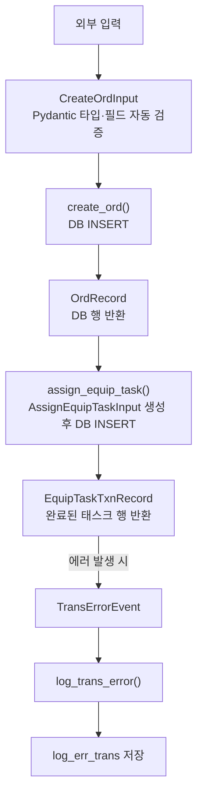

## 1. Pydantic 일반 설명

Pydantic은 Python에서 **데이터의 타입과 구조를 검증**하는 라이브러리다.
클래스를 정의하면 그 클래스의 객체(object)로 데이터를 주고받고, 타입이 맞지 않으면 자동으로 에러를 낸다.

```python
from pydantic import BaseModel

class CreateOrdInput(BaseModel):
    user_id: int
    quantity: int

data = CreateOrdInput(user_id=1, quantity=3)      # OK
data = CreateOrdInput(user_id="abc", quantity=3)  # ValidationError 자동 발생
```

### 1-1. Naming Style 비교

| 이름                        | 규칙                               | 예시                |
| --------------------------- | ---------------------------------- | ------------------- |
| **PascalCase**              | 모든 단어 첫 글자 대문자           | `CreateTaskInput`   |
| **camelCase**               | 첫 단어만 소문자, 나머지 대문자    | `createTaskInput`   |
| **snake_case**              | 소문자 + 언더바                    | `create_task_input` |
| **kebab-case**              | 소문자 + 하이픈                    | `create-task-input` |
| **SCREAMING_SNAKE_CASE**    | 전체 대문자 + 언더바               | `AMR_COORDS`        |
| **`_SCREAMING_SNAKE_CASE`** | 앞에 `_` 붙인 SCREAMING_SNAKE_CASE | `_AMR_COORDS`       |
| **`_snake_case`**           | 앞에 `_` 붙인 snake_case           | `_run()`            |

{: .table .table-sm .table-striped}

```
create task input  →  (PascalCase)           CreateTaskInput
                   →  (camelCase)            createTaskInput
                   →  (snake_case)           create_task_input
                   →  (kebab-case)           create-task-input
AMR coordinates   →  (SCREAMING_SNAKE_CASE) AMR_COORDS
                   →  (module-private)       _AMR_COORDS
```

Python [PEP 8](https://peps.python.org/pep-0008/) 표준:

- **클래스명** → PascalCase (`class CreateTaskInput`)
- **함수/변수명** → snake_case (`def create_task()`)
- **상수** → SCREAMING_SNAKE_CASE (`MAX_RETRY = 3`, `AMR_COORDS = {...}`)

**`_` 앞에 붙이는 의미** — "이 파일 안에서만 써라, 외부에서 `import`하지 마라"는 신호다. 클래스·함수·변수·상수 모두에 붙일 수 있다.

| 종류   | 공개         | 모듈 내부 전용 |
| ------ | ------------ | -------------- |
| 클래스 | `AmrCoord`   | `_AmrCoord`    |
| 상수   | `AMR_COORDS` | `_AMR_COORDS`  |
| 함수   | `run()`      | `_run()`       |

{: .table .table-sm .table-striped}

### 1-2. 모델 클래스 Suffix 규칙

데이터의 역할에 따라 접미사(Suffix)를 붙여 구분한다.

| Suffix   | 용도                 | 패턴                 | 예시                 |
| -------- | -------------------- | -------------------- | -------------------- |
| `Input`  | 함수에 넣는 입력값   | `[동사][명사]Input`  | `CreateOrdInput`     |
| `Record` | DB 행(row) 1:1 표현  | `[테이블명]Record`   | `OrdRecord`          |
| `Result` | 연산 결과 (DB 아님)  | `[동사][명사]Result` | `AllocateTaskResult` |
| `Event`  | 이벤트/로그 페이로드 | `[명사]Event`        | `TransErrorEvent`    |

{: .table .table-sm .table-striped}

### 1-3. 필드명 — `snake_case`

```python
class CreateOrdInput(BaseModel):
    user_id: int           # snake_case
    prod_opt_id: int
    quantity: int
```

### 1-4. 유효성 검사 & 데코레이터

`BaseModel` 안에 선언된 변수들을 **field(필드)**라고 한다. 유효성 검사 방법은 복잡도에 따라 세 가지로 나뉜다.

| 방법                   | 코드                         | 언제 쓰나                            |
| ---------------------- | ---------------------------- | ------------------------------------ |
| **타입 힌트만**        | `quantity: int`              | 타입만 맞으면 충분할 때              |
| **`Field()`**          | `Field(gt=0, max_length=50)` | 범위·길이 같은 단순 조건             |
| **`@field_validator`** | 데코레이터 함수              | 위 두 가지로 표현 못하는 복잡한 로직 |

{: .table .table-sm .table-striped}

> 단순 범위·길이 → `Field()` / 복잡한 로직·변환 → `@field_validator` / 여러 필드를 같이 봐야 하면 → `@model_validator`
> {: .block-tip }

---



데코레이터의 문자열 인자가 **어떤 필드에 연결된 검증 함수인지** Pydantic에 알려준다. 해당 필드 값이 들어올 때 자동으로 호출되며, 여러 필드에 동시에 적용할 수도 있다.

```python
@field_validator("quantity")           # quantity 필드 전용
@field_validator("user_id", "quantity")  # 두 필드 모두 이 함수로 검증
```

`@classmethod`가 같이 붙는 이유: 객체가 만들어지기 **전**에 값을 검사하므로 `self`가 없다. Pydantic v2 스펙상 `cls`를 받는 classmethod로 선언해야 한다. 실제로 `cls`를 쓸 일은 거의 없다.

```python
class CreateOrdInput(BaseModel):
    quantity: int
    phone: str

    @field_validator("quantity")
    @classmethod
    def validate_quantity(cls, v: int) -> int:
        if v % 10 != 0:                       # Field()로 표현 불가한 비즈니스 로직
            raise ValueError("10의 배수만 허용")
        return v

    @field_validator("phone")
    @classmethod
    def validate_phone(cls, v: str) -> str:
        if not re.match(r"^010-\d{4}-\d{4}$", v):
            raise ValueError("전화번호 형식 오류")
        return v.replace("-", "")             # 검증 후 값 변환도 가능

    @field_validator("quantity")
    @classmethod
    def check_db(cls, v: int) -> int:
        if not db.exists(v):                  # DB 조회도 가능
            raise ValueError("존재하지 않는 값")
        return v
```

실행 흐름:

```text
CreateOrdInput(quantity=-1)
      ↓
Pydantic: "quantity 필드 들어왔다"
      ↓
@field_validator("quantity") 찾아서 실행
      ↓
validate_quantity(cls, v=-1) 호출
      ↓
raise ValueError → ValidationError 발생
```





범위·길이처럼 단순한 조건은 `@field_validator` 없이 한 줄로 처리할 수 있다.

```python
class CreateOrdInput(BaseModel):
    quantity:  int = Field(gt=0)                       # 0 초과
    user_id:   int = Field(ge=1)                       # 1 이상
    prod_nm:   str = Field(min_length=1, max_length=50)
```

| 옵션                        | 의미                    |
| --------------------------- | ----------------------- |
| `gt`                        | 초과 (greater than)     |
| `ge`                        | 이상 (greater or equal) |
| `lt`                        | 미만                    |
| `le`                        | 이하                    |
| `min_length` / `max_length` | 문자열 길이             |
| `pattern`                   | 정규식                  |

{: .table .table-sm .table-striped}





한 필드만으로는 판단할 수 없고, **두 필드 이상을 같이 봐야** 할 때 사용한다. `mode` 파라미터로 실행 시점을 결정한다.

|                      | `mode="before"`               | `mode="after"`                |
| -------------------- | ----------------------------- | ----------------------------- |
| 실행 시점            | 필드 변환·검증 전             | 모든 필드 검증 완료 후        |
| 받는 것              | raw `dict`                    | 완성된 모델 인스턴스 (`self`) |
| 반환                 | `dict`                        | `self`                        |
| 언제 씀              | 데이터 전처리, 필드 이름 변환 | 필드 간 관계 검증             |
| `@classmethod` 필요? | ✅                            | ❌                            |

{: .table .table-sm .table-striped}

```python
class ShipmentOrdInput(BaseModel):
    quantity: int
    available_stock: int

    @model_validator(mode="after")
    def validate_stock(self) -> "ShipmentOrdInput":
        if self.quantity > self.available_stock:
            raise ValueError("수량이 재고보다 많습니다")
        return self

ShipmentOrdInput(quantity=10, available_stock=5)   # ValidationError
ShipmentOrdInput(quantity=3,  available_stock=5)   # OK
```





DB에 저장하진 않지만 응답에 포함시키고 싶은 파생 값이 있을 때 사용한다.

```python
class OrdRecord(BaseModel):
    unit_price: int
    quantity:   int

    @computed_field
    @property
    def total_price(self) -> int:
        return self.unit_price * self.quantity

record = OrdRecord(unit_price=1000, quantity=3)
print(record.total_price)   # 3000
print(record.model_dump())  # {'unit_price': 1000, 'quantity': 3, 'total_price': 3000}
```





DB에서 꺼낸 값과 API 응답으로 내보낼 형식이 다를 때 (특히 날짜·enum) 사용한다.

```python
class OrdRecord(BaseModel):
    created_at: datetime

    @field_serializer("created_at")
    def serialize_created_at(self, v: datetime) -> str:
        return v.strftime("%Y-%m-%d %H:%M")

record = OrdRecord(created_at=datetime(2026, 4, 28, 9, 0))
print(record.model_dump())
# {'created_at': '2026-04-28 09:00'}   ← datetime 객체가 아닌 문자열로 출력
```





| 데코레이터          | 언제 쓰나                           |
| ------------------- | ----------------------------------- |
| `@field_validator`  | 특정 필드 하나 (또는 여러 개) 검증  |
| `@model_validator`  | 필드 간 관계 검증                   |
| `Field()`           | 간단한 범위·길이 제약 (함수 불필요) |
| `@computed_field`   | DB에 없는 계산값 노출               |
| `@field_serializer` | JSON 출력 형식 커스텀               |

{: .table .table-sm .table-striped}



### 1-5. model_config (Pydantic v2)

`model_config`는 Pydantic 모델의 동작 방식을 설정하는 클래스 변수다. `ConfigDict`로 옵션을 넘긴다.

| 옵션                   | 언제 쓰나                          | 주로 붙는 suffix |
| ---------------------- | ---------------------------------- | ---------------- |
| `from_attributes=True` | DB ORM 객체 → Pydantic 변환        | `Record`         |
| `frozen=True`          | 생성 후 값 변경 불가 (불변 설정값) | 좌표·설정 클래스 |

{: .table .table-sm .table-striped}

#### `from_attributes=True` — DB 행을 Pydantic으로 변환

Pydantic은 기본적으로 `dict`를 입력으로 받는다. 그런데 DB에서 꺼낸 ORM 객체는 `dict`가 아니라 **속성(attribute)**을 가진 객체다.

```python
# DB에서 꺼낸 ORM 객체 (dict가 아님)
db_row.user_id    # attribute 접근
db_row.quantity

# 기본 상태 — dict만 받으므로 ORM 객체를 넘기면 에러
OrdRecord(user_id=db_row.user_id, quantity=db_row.quantity)  # 이렇게 일일이 풀어야 함

# from_attributes=True 설정 후 — ORM 객체를 바로 넘길 수 있음
class OrdRecord(BaseModel):
    model_config = ConfigDict(from_attributes=True)
    user_id: int
    quantity: int

OrdRecord.model_validate(db_row)  # ORM 객체를 바로 변환
```

즉, DB → Pydantic 변환을 깔끔하게 하기 위한 설정이다. `Record` suffix가 붙은 클래스에 주로 붙는다.

#### `frozen=True` — 불변 설정값 (로봇 좌표 등)

로봇 좌표처럼 런타임에 절대 바뀌면 안 되는 설정값에 쓴다. 인스턴스 생성 후 필드를 수정하려 하면 에러를 낸다.

```python
class AmrCoord(BaseModel):
    model_config = ConfigDict(frozen=True)

    x: float
    y: float
    theta: float


class ArmPose(BaseModel):
    model_config = ConfigDict(frozen=True)

    x: float
    y: float
    z: float
    roll: float
    pitch: float
    yaw: float


_AMR_COORDS: dict[str, AmrCoord] = {
    "MV_SRC":      AmrCoord(x=0.90, y=0.30, theta=0.00),
    "MV_DEST":     AmrCoord(x=0.50, y=1.00, theta=1.57),
    "MV_SHIP":     AmrCoord(x=0.90, y=1.70, theta=0.00),
    "MV_CHG":      AmrCoord(x=0.10, y=0.10, theta=0.00),
    "RETURN_IDLE": AmrCoord(x=0.10, y=0.10, theta=0.00),
}

coord = _AMR_COORDS["MV_SRC"]
coord.x = 1.0   # TypeError: frozen — 수정 불가
```

`_AMR_COORDS`처럼 앞에 `_`를 붙인 이유는 이 파일 밖에서 직접 import하지 말라는 신호다. 일반 `dict[str, tuple]`로 쓰던 것과 비교하면:

```python
# 기존 tuple 방식 — 인덱스로만 접근
coord = _AMR_COORDS["MV_SRC"]   # (0.90, 0.30, 0.00)
coord[0]   # x?  y?  헷갈림

# Pydantic frozen 방식 — 이름으로 접근
coord.x      # 0.90
coord.y      # 0.30
coord.theta  # 0.00
```

---

<br>

## 2. SmartCast Robotics Project — 테이블 종류 요약

| 테이블 종류           | 언제 쓰는가                  | Pydantic Suffix                                | 해당 테이블                                                                                                                                                                                              |
| --------------------- | ---------------------------- | ---------------------------------------------- | -------------------------------------------------------------------------------------------------------------------------------------------------------------------------------------------------------- |
| **Master**            | 기준·설정 데이터. 잘 안 변함 | `Record`                                       | `user_account`, `category`, `product`, `product_option`, `pp_options`, `res`, `equip_load_spec`, `zone`, `equip`, `trans`, `trans_task_bat_threshold`                                                    |
| **Operational (txn)** | 작업 발생·진행 기록          | 생성 입력 → `Input` / DB 조회 → `Record`       | `ord`, `ord_detail`, `ord_pp_map`, `ord_txn`, `equip_task_txn`, `trans_task_txn`, `insp_task_txn`, `pp_task_txn`                                                                                         |
| **State (stat)**      | 현재 상태 스냅샷. 빠른 조회  | `Record`                                       | `item_stat`, `ord_stat`, `equip_stat`, `trans_stat`, `chg_loc_stat`, `strg_loc_stat`, `ship_loc_stat`, `pattern_stat`, `alerts_stat`                                                                     |
| **Log**               | 행동/이벤트/데이터/에러 기록 | 행동·이벤트 → `Event` / 데이터·에러 → `Record` | `ord_log`, `log_action_user`, `log_action_operator_handoff_acks`, `log_action_operator_rfid_scan`, `log_action_admin`, `log_event`, `log_data_equip`, `log_data_trans`, `log_err_equip`, `log_err_trans` |

{: .table .table-sm .table-striped}

---

<br>

## 3. SmartCast Robotics Project — ERD → Pydantic 클래스명 매핑



| DB 테이블                  | Pydantic 클래스               |
| -------------------------- | ----------------------------- |
| `user_account`             | `UserAccountRecord`           |
| `category`                 | `CategoryRecord`              |
| `product`                  | `ProductRecord`               |
| `product_option`           | `ProductOptionRecord`         |
| `pp_options`               | `PpOptionsRecord`             |
| `res`                      | `ResRecord`                   |
| `equip_load_spec`          | `EquipLoadSpecRecord`         |
| `zone`                     | `ZoneRecord`                  |
| `equip`                    | `EquipRecord`                 |
| `trans`                    | `TransRecord`                 |
| `trans_task_bat_threshold` | `TransTaskBatThresholdRecord` |

{: .table .table-sm .table-striped}





| DB 테이블        | 쓰임                    | Pydantic 클래스        |
| ---------------- | ----------------------- | ---------------------- |
| `ord`            | 주문 생성 입력          | `CreateOrdInput`       |
| `ord`            | DB 행 조회              | `OrdRecord`            |
| `ord_detail`     | 상세 생성 입력          | `CreateOrdDetailInput` |
| `ord_detail`     | DB 행 조회              | `OrdDetailRecord`      |
| `ord_pp_map`     | 후처리 옵션 매핑 입력   | `CreateOrdPpMapInput`  |
| `ord_pp_map`     | DB 행 조회              | `OrdPpMapRecord`       |
| `ord_txn`        | 주문 상태 전이 입력     | `CreateOrdTxnInput`    |
| `ord_txn`        | DB 행 조회              | `OrdTxnRecord`         |
| `equip_task_txn` | 태스크 할당 입력        | `AssignEquipTaskInput` |
| `equip_task_txn` | DB 행 조회              | `EquipTaskTxnRecord`   |
| `trans_task_txn` | 태스크 할당 입력        | `AssignTransTaskInput` |
| `trans_task_txn` | DB 행 조회              | `TransTaskTxnRecord`   |
| `insp_task_txn`  | 검사 태스크 생성 입력   | `CreateInspTaskInput`  |
| `insp_task_txn`  | DB 행 조회              | `InspTaskTxnRecord`    |
| `pp_task_txn`    | 후처리 태스크 생성 입력 | `CreatePpTaskInput`    |
| `pp_task_txn`    | DB 행 조회              | `PpTaskTxnRecord`      |

{: .table .table-sm .table-striped}





| DB 테이블       | Pydantic 클래스     |
| --------------- | ------------------- |
| `item_stat`     | `ItemStatRecord`    |
| `ord_stat`      | `OrdStatRecord`     |
| `equip_stat`    | `EquipStatRecord`   |
| `trans_stat`    | `TransStatRecord`   |
| `chg_loc_stat`  | `ChgLocStatRecord`  |
| `strg_loc_stat` | `StrgLocStatRecord` |
| `ship_loc_stat` | `ShipLocStatRecord` |
| `pattern_stat`  | `PatternStatRecord` |
| `alerts_stat`   | `AlertsStatRecord`  |

{: .table .table-sm .table-striped}





| DB 테이블                          | Pydantic 클래스        |
| ---------------------------------- | ---------------------- |
| `ord_log`                          | `OrdLogRecord`         |
| `log_action_user`                  | `UserActionEvent`      |
| `log_action_operator_handoff_acks` | `OperatorHandoffEvent` |
| `log_action_operator_rfid_scan`    | `RfidScanEvent`        |
| `log_action_admin`                 | `AdminActionEvent`     |
| `log_event`                        | `SystemEvent`          |
| `log_data_equip`                   | `EquipDataRecord`      |
| `log_data_trans`                   | `TransDataRecord`      |
| `log_err_equip`                    | `EquipErrorRecord`     |
| `log_err_trans`                    | `TransErrorRecord`     |

{: .table .table-sm .table-striped}



### 함수 흐름 예시

Pydantic 클래스 네이밍이 왜 중요한지는 실제 함수 흐름을 보면 이해가 된다.

각 함수는 **Pydantic 클래스를 입력으로 받고, Pydantic 클래스를 반환**한다. 함수 시그니처만 봐도 어떤 데이터가 들어오고 나가는지, 어떤 목적의 클래스인지 바로 알 수 있다.

```python
def create_ord(data: CreateOrdInput) -> OrdRecord: ...
#                    ↑ Input suffix    ↑ Record suffix
#              "주문 생성 입력값"       "DB에서 꺼낸 주문 행"

def assign_equip_task(data: AssignEquipTaskInput) -> EquipTaskTxnRecord: ...
def get_trans_stat(trans_id: int) -> TransStatRecord: ...
def log_trans_error(event: TransErrorEvent) -> None: ...
```

이 패턴의 핵심은 **검증이 경계마다 자동으로 일어난다**는 것이다. 외부에서 잘못된 값이 들어오면 `CreateOrdInput` 생성 시점에 즉시 `ValidationError`가 나고, DB 조회 결과를 `OrdRecord`로 변환할 때도 타입이 맞지 않으면 바로 에러가 난다. 값이 함수 안 깊숙이 들어가서 터지는 게 아니라 **경계에서 먼저 막힌다**.



`OrdRecord`처럼 DB 조회 결과를 받는 클래스에는 앞서 설명한 `from_attributes=True`가 붙어서, SQLAlchemy ORM 객체를 바로 Pydantic 모델로 변환할 수 있다.

---

### 제네릭 DB 유틸 함수 패턴 — `type[T]`

위 함수들은 테이블마다 별도로 만들지 않고, **어떤 Pydantic 모델이든 받을 수 있는 제네릭 함수** 하나로 공통화할 수 있다. `state_manager.py`가 이 패턴을 사용한다.

```python
from pydantic import BaseModel
from typing import TypeVar

T = TypeVar("T", bound=BaseModel)
# "T는 아직 정해지지 않은 타입인데, BaseModel을 상속한 클래스여야 한다"
```

`TypeVar`는 함수가 호출될 때 구체적인 타입으로 확정되는 자리표시자다.

```python
async def insert_row(
    pool: asyncpg.Pool,
    table: str,
    data: BaseModel,       # 어떤 Pydantic 인스턴스든 받음
    return_type: type[T],  # 어떤 Pydantic 클래스 자체를 받음
) -> T:                    # 반환 타입은 넘긴 클래스와 동일하게 확정
    row = await c.fetchrow(query, *vals)
    return return_type(**dict(row))   # 넘긴 클래스로 인스턴스 생성
```

`type[T]`는 인스턴스가 아니라 **클래스 자체**를 받는다는 뜻이다.

```python
OrdRecord(ord_id=1, ...)  # 인스턴스  → data: BaseModel 에 해당
OrdRecord                 # 클래스 자체 → return_type: type[T] 에 해당
```

`T`가 `return_type`과 반환값을 **묶어주는 역할**을 하기 때문에, 어떤 클래스를 넘기냐에 따라 반환 타입이 자동으로 추론된다.

```python
# OrdRecord를 넘기면 → T = OrdRecord → 반환값이 OrdRecord로 추론됨
result = await insert_row(pool, "ord", data, OrdRecord)
result.ord_id   # 타입 체커(mypy/pyright)가 자동완성 인식

# EquipTaskTxnRecord를 넘기면 → T = EquipTaskTxnRecord
result = await insert_row(pool, "equip_task_txn", data, EquipTaskTxnRecord)
result.txn_stat  # 마찬가지로 인식
```

이 패턴 덕분에 테이블마다 함수를 만들지 않고 `insert_row` / `read_stat` / `update_stat` 세 개로 모든 테이블을 처리할 수 있다.
