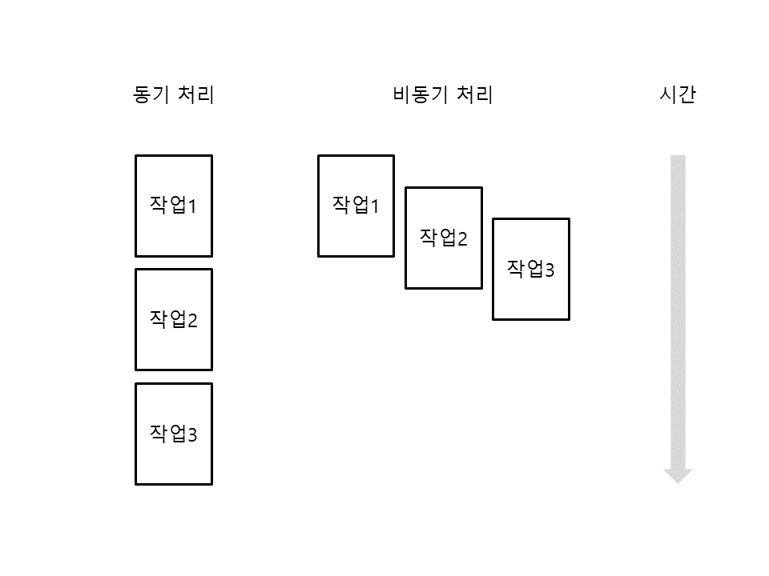

# asyncio 사용하기 

> asyncio (Asynchronous I/O)는 비동기 프로그래밍을 위한 모듈이며 I/O 작업을 효율적으로 동시에 처리하게 해줌
> 동기 (synchronous) 처리는 특정 작업이 끝나면 다음 작업을 처리하는 순차처리 방식이고, 비동기 (asynchronous) 처리는 여러 작업을 처리하도록 예약한 뒤 작업이 끝나면 결과를 받는 방식



## 필수 개념 

* 파이썬에서는 제너레이터 기반(yield / yield from)의 코루틴과 구분하기 위해 async def로 만든 코루틴은 네이티브 코루틴이라고 함
  * python 3.5 부터 `async def` / `await` 문법이 언어 차원에서 정식 지원되어 "네이티브 (native)"라 명명 
  * 코루틴 (coroutine): 다른 실행 흐름과 협력 (co) 하면서 번갈아 실행되는 함수라는 의미
* async def 키워드는 파이썬 3.5 이상부터 사용 가능 (이전까지 데코레이터 @asyncio.coroutine 사용)
* 이벤트 루프 (event loop): 비동기 작업들을 관리하는 실행 관리자 
  * await keyword: `await`를 만나면 현재 코루틴은 일시 중단되고, 이벤트 루프는 해당 작업이 끝났을 때 다시 실행할 수 있도록 기록함
  * 기다리는 동안 이벤트 루프는 멈추지 않고 실행 가능한 다른 Task나 콜백을 처리함
  * `loop`처럼 계속 돌면서 실행할 작업을 찾는다.

````{admonition} yield, yield from, await 
:class: dropdown 
 
* yield: 값을 하나 내보내고 멈춤, 다음 next()가 실행될때까지 
* yield from: 다른 제너레이터/이터러블에 위임해서 그 안의 yield들을 바깥으로 전달함
* asyncio의 yield from: await이 나오기 전, 비동기 작업을 기다리는 지점으로 사용됨
* await: 현재 코루틴을 멈추고, 이벤트 루프에게 제어권을 넘긴 뒤, 작업 완료 후 이어서 실행
````

````{admonition} event loop 의 동작 원리 
:class: note 

1. 실행 가능한 Task나 콜백을 실행한다
2. await를 만나면 잠시 멈춘다
3. I/O, 타이머, 네트워크 응답 등을 기다린다
4. 준비된 Task를 다시 이어서 실행한다
5. 이 과정을 반복한다
````

```python
import asyncio

# old style
@asyncio.coroutine
def old_coro():
    result = yield from some_io() # 이 작업이 끝날 때까지 현재 코루틴을 멈추고 이벤트 루프에 맡긴다.
    return result

# yield를 사용하는 일반 제너레이터 예시
def numbers():
    yield 1
    yield 2

g = numbers()
next(g) # 1을 반환하고 함수 실행이 멈춤
next(g) # 멈췄던 자리부터 이어서 실행되어 2를 반환함

# new style
async def fetch_data(): # 코루틴 함수
    await some_io()
    return "done"

fetch_data() # 코루틴 객체
```

## native coroutine 생성

* 이벤트 루프: asyncio.get_event_loop()
* 이벤트루프.run_until_complete (코루틴 객체 또는 퓨처 객체)

```python
import asyncio

async def hello(): # async def로 네이티브 코루틴을 만듦. 
    print('Hello, world!')

loop = asyncio.get_event_loop()  # 이벤트 루프를 얻음 
loop.run_until_complete(hello()) # hello가 끝날 때까지 기다림 
loop.close() # 이벤트 루프를 닫음 
```

실험 결과
```
hello, world!
```

> `run_until_complete`: 네이티브 코루틴이 이벤트 루프에서 실행되도록 "예약"하고, 해당 네이티브 코루틴이 끝날때까지 기다림.
> 이벤트 루프를 통해서 hello coroutine 이 실행됨 
> 할 일이 끝났으면 loop.close로 이벤트 루프를 닫아줌. 

## await 로 네이티브 코루틴 실행하기 

* 다음과 같이 `await` 뒤에 코루틴 객체, Future 객체, Task 객체 같은 awaitable 객체를 지정하면 해당 객체가 끝날 때까지 현재 코루틴이 일시 중단됨
* 이때 이벤트 루프는 멈추지 않고, 실행 가능한 다른 Task나 콜백을 처리함
* await한 객체가 완료되면 이벤트 루프는 중단된 코루틴을 다시 실행하고, 완료 결과를 `await` 표현식의 값으로 반환함
* `await`는 단어 뜻 그대로 특정 객체가 끝날 때까지 기다리는 것처럼 보이지만, 실제로는 현재 코루틴만 멈추고 이벤트 루프에 제어권을 넘기는 것
* `await` 키워드는 파이썬 3.5 이상부터 사용 가능, 3.4 에서는 `yield from`을 사용
* 주의점: `await`는 네이티브 코루틴 안에서만 사용할 수 있음.

이벤트 루프가 네이티브 코루틴 객체만 직접 실행하는 것은 아님. 보통 코루틴은 `Task`로 감싸져 이벤트 루프에 의해 스케줄링되고, 이벤트 루프는 Future, Task, 콜백, 타이머, I/O 이벤트 등을 함께 관리함.

일반 함수도 콜백으로 등록하면 이벤트 루프가 실행할 수 있음. 하지만 일반 함수는 `await`로 제어권을 넘길 수 없기 때문에, 오래 걸리는 동기 작업을 그대로 실행하면 이벤트 루프를 막을 수 있음.

```
변수 = await 코루틴 객체 
변수 = await Future 객체
변수 = await Task 객체
```

```python
import asyncio

async def a():
    print("a start")
    await asyncio.sleep(1)
    print("a end")
    return "A"

async def b():
    print("b start")
    await asyncio.sleep(1)
    print("b end")
    return "B"

async def main():
    task1 = asyncio.create_task(a())
    task2 = asyncio.create_task(b())

    result = await task1 # task1이 끝날 때까지 main 코루틴은 멈춤
    print(result)

    await task2

asyncio.run(main())
```

실행 흐름

```text
a start
b start
... 1초 대기 ...
a end
b end
A
```
